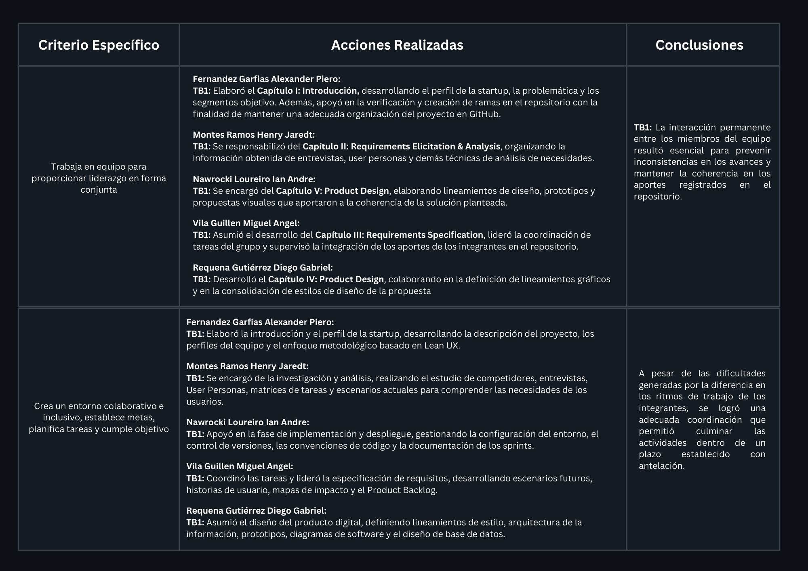
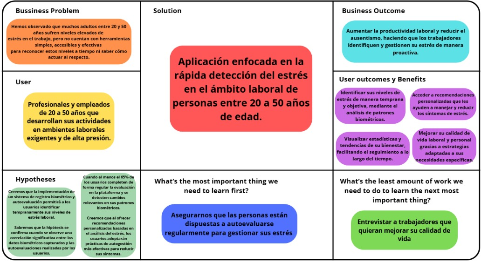
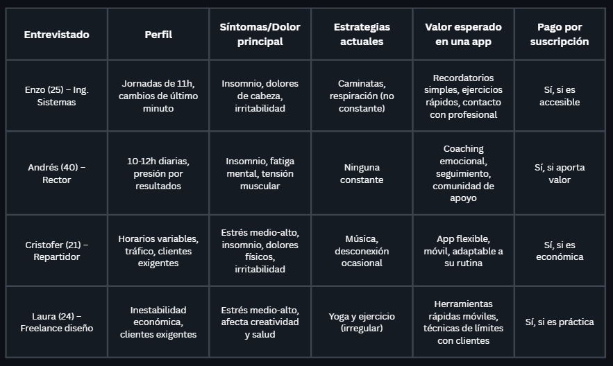
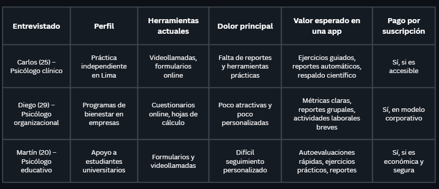
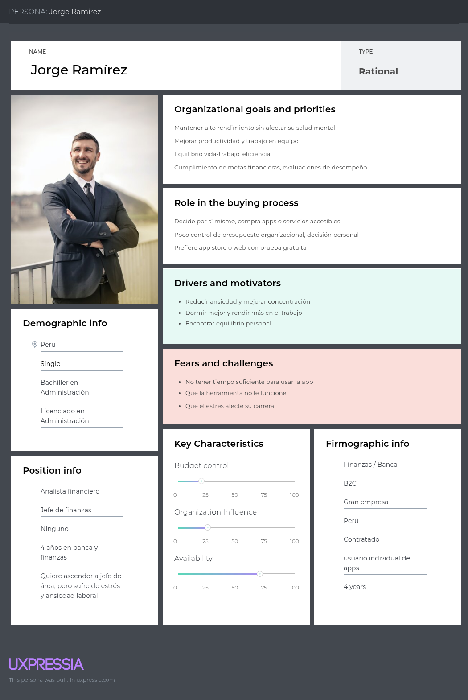
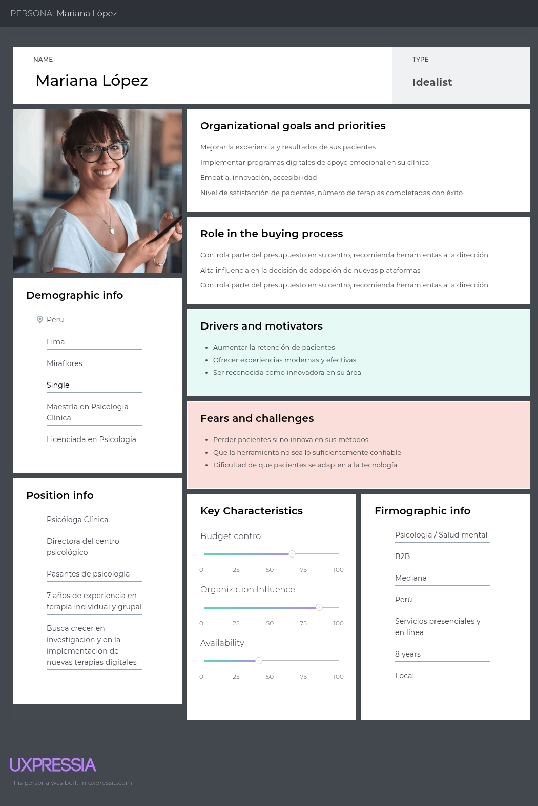
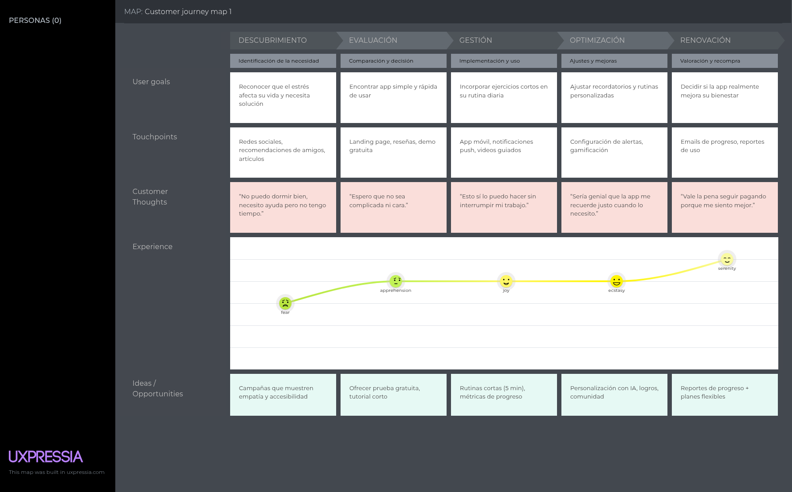
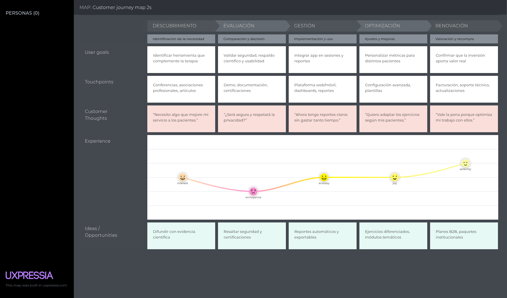
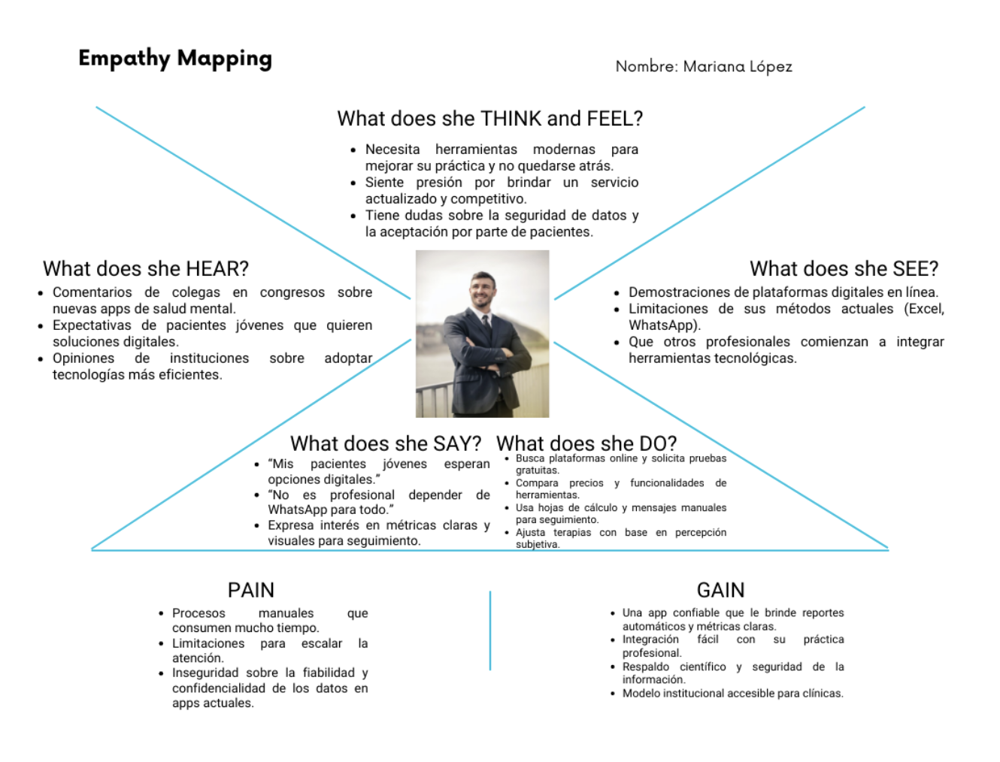
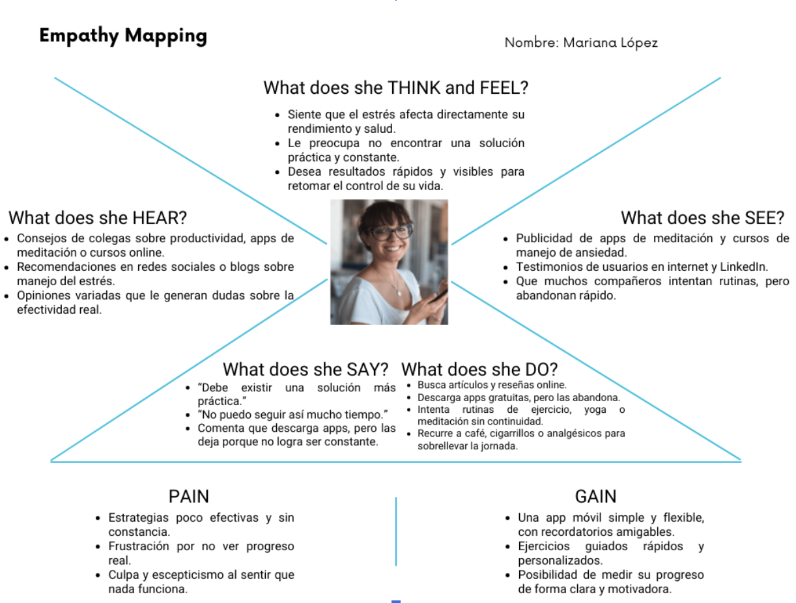

  
  
  <h2>Universidad: Universidad Peruana de Ciencias Aplicadas</h2>
  
<strong>Carrera:</strong> Ingeniería de Software

  
<strong>Ciclo:</strong> 2025-2

  
<strong>Código del Curso : </strong> 1ASI0729

  
<strong>Nombre del Curso : </strong>  Desarrollo de Aplicaciones Open Source

  
<strong>Sección:</strong> 7369

  
<strong>Profesor:</strong> Wilder Julio Espinoza Bravo

  <h3>Informe de Trabajo Final</h3>

  
<strong>Startup:</strong> NeuroZen

  
<strong>Nombre del Producto:</strong> NeuroZen/p>

<h3 align="center">Relación de Integrantes:</h3>

  <table>
    <tr>
      <th><strong>Código</strong></th>
      <th><strong>Apellidos y Nombres</strong></th>
    </tr>
    <tr>
      <td>U20231G054</td>
      <td>Fernandez Garfias Alexander Piero</td>
    </tr>
    <tr>
      <td>U20231B475</td>
      <td>Montes Ramos Henry Jaredt</td>
    </tr>
    <tr>
      <td>U20231G159</td>
      <td>Nawrocki Loureiro Ian Andre</td>
    </tr>
    <tr>
      <td>U20231G054</td>
      <td>Vila Guillen Miguel Angel</td>
    </tr>
    <tr>
      <td>U202321774</td>
      <td>Requena Gutiérrez, Diego Gabriel</td>
    </tr>
  </table>  

## Registro de Versiones del Informe

| **Versión** | **Fecha**   | **Autores**                                                                                     | **Descripción de Modificación**                                                                                                                                                                  |
|-------------|-------------|--------------------------------------------------------------------------------------------------|---------------------------------------------------------------------------------------------------------------------------------------------------------------------------------------------------|
| 1.0         | 09/09/2025  | - Fernandez Garfias Alexander Piero    - Montes Ramos Henry Jaredt    - Nawrocki Loureiro Ian Andre   - Vila Guillen Miguel Angel   - Requena Gutiérrez, Diego Gabriel | Se incluyeron los siguientes capítulos:  • Estructura del informe  • Capítulo I: Introducción  • Capítulo II: Requirements Elicitation & Analysis  • Capítulo III: Requirements Specification  • Capítulo IV: Product Design  • Capítulo V: Product Implementation, Validation & Deployment  • Landing Page |

---
## Project Report Collaboration Insights

**Link del repositorio del informe:**  
[https://github.com/1ASI0729-2520-7369-G2-NeuroZen/Report/tree/main](https://github.com/1ASI0729-2520-7369-G2-NeuroZen/Report/tree/main)

**Link de los repositorios de la organización:**  
[https://github.com/orgs/1ASI0729-2520-7369-G2-NeuroZen/repositories](https://github.com/orgs/1ASI0729-2520-7369-G2-NeuroZen/repositories)

El desarrollo de este informe se llevó a cabo de manera colaborativa a través de la plataforma GitHub, empleando la metodología GitFlow y la estandarización de Conventional Commits. La participación de cada integrante del equipo se materializó mediante la creación de ramas independientes, la realización de aportes individuales y la validación conjunta a través de revisiones de Pull Requests

---

## Contenido

- [Carátula](#carátula)
- [Registro de Versiones del Informe](#registro-de-versiones-del-informe)
- [Project Report Collaboration Insights](#project-report-collaboration-insights)
- [Contenido](#contenido)
- [Student Outcome](#student-outcome)
- [Capítulo I: Introducción](#capítulo-i-introducción)
  - [1.1 Startup Profile](#11-startup-profile)
    - [1.1.1 Descripción de la Startup](#111-descripción-de-la-startup)
    - [1.1.2 Perfiles de integrantes del equipo](#112-perfiles-de-integrantes-del-equipo)
  - [1.2 Solution Profile](#12-solution-profile)
    - [1.2.1 Antecedentes y problemática](#121-antecedentes-y-problemática)
    - [1.2.2 Lean UX Process](#122-lean-ux-process)
      - [1.2.2.1 Lean UX Problem Statements](#1221-lean-ux-problem-statements)
      - [1.2.2.2 Lean UX Assumptions](#1222-lean-ux-assumptions)
      - [1.2.2.3 Lean UX Hypothesis Statements](#1223-lean-ux-hypothesis-statements)
      - [1.2.2.4 Lean UX Canvas](#1224-lean-ux-canvas)
  - [1.3 Segmentos objetivo](#13-segmentos-objetivo)
- [Capítulo II: Requirements Elicitation & Analysis](#capítulo-ii-requirements-elicitation--analysis)  
  - [2.1 Competidores](#21-competidores)  
    - [2.1.1 Análisis competitivo](#211-análisis-competitivo)  
    - [2.1.2 Estrategias y tácticas frente a competidores](#212-estrategias-y-tácticas-frente-a-competidores)  
  - [2.2 Entrevistas](#22-entrevistas)  
    - [2.2.1 Diseño de entrevistas](#221-diseño-de-entrevistas)  
    - [2.2.2 Registro de entrevistas](#222-registro-de-entrevistas)  
    - [2.2.3 Análisis de entrevistas](#223-análisis-de-entrevistas)  
  - [2.3 Needfinding](#23-needfinding)  
    - [2.3.1 User Personas](#231-user-personas)  
    - [2.3.2 User Task Matrix](#232-user-task-matrix)  
    - [2.3.3 User Journey Mapping](#233-user-journey-mapping)  
    - [2.3.4 Empathy Mapping](#234-empathy-mapping)  
    - [2.3.5 As-is Scenario Mapping](#235-as-is-scenario-mapping)  
  - [2.4 Ubiquitous Language](#24-ubiquitous-language)  
- [Capítulo III: Requirements Specification](#capítulo-iii-requirements-specification)  
  - [3.1 To-Be Scenario Mapping](#31-to-be-scenario-mapping)  
  - [3.2 User Stories](#32-user-stories)  
  - [3.3 Impact Mapping](#33-impact-mapping)  
  - [3.4 Product Backlog](#34-product-backlog)  
- [Capítulo IV: Product Design](#capítulo-iv-product-design)  
  - [4.1 Style Guidelines](#41-style-guidelines)  
    - [4.1.1 General Style Guidelines](#411-general-style-guidelines)  
    - [4.1.2 Web Style Guidelines](#412-web-style-guidelines)  
  - [4.2 Information Architecture](#42-information-architecture)  
    - [4.2.1 Organization Systems](#421-organization-systems)  
    - [4.2.2 Labeling Systems](#422-labeling-systems)  
    - [4.2.3 SEO Tags and Meta Tags](#423-seo-tags-and-meta-tags)  
    - [4.2.4 Searching Systems](#424-searching-systems)  
    - [4.2.5 Navigation Systems](#425-navigation-systems)  
  - [4.3 Landing Page UI Design](#43-landing-page-ui-design)  
    - [4.3.1 Landing Page Wireframe](#431-landing-page-wireframe)  
    - [4.3.2 Landing Page Mock-up](#432-landing-page-mock-up)  
  - [4.4 Web Applications UX/UI Design](#44-web-applications-uxui-design)  
    - [4.4.1 Web Applications Wireframes](#441-web-applications-wireframes)  
    - [4.4.2 Web Applications Wireflow Diagrams](#442-web-applications-wireflow-diagrams)  
    - [4.4.2 Web Applications Mock-ups](#442-web-applications-mock-ups)  
    - [4.4.3 Web Applications User Flow Diagrams](#443-web-applications-user-flow-diagrams)  
  - [4.5 Web Applications Prototyping](#45-web-applications-prototyping)  
  - [4.6 Domain-Driven Software Architecture](#46-domain-driven-software-architecture)  
    - [4.6.1 Software Architecture Context Diagram](#461-software-architecture-context-diagram)  
    - [4.6.2 Software Architecture Container Diagrams](#462-software-architecture-container-diagrams)  
    - [4.6.3 Software Architecture Components Diagrams](#463-software-architecture-components-diagrams)  
  - [4.7 Software Object-Oriented Design](#47-software-object-oriented-design)  
    - [4.7.1 Class Diagrams](#471-class-diagrams)  
    - [4.7.2 Class Dictionary](#472-class-dictionary)  
  - [4.8 Database Design](#48-database-design)  
    - [4.8.1 Database Diagram](#481-database-diagram)  
- [Capítulo V: Product Implementation, Validation & Deployment](#capítulo-v-product-implementation-validation--deployment)  
  - [5.1 Software Configuration Management](#51-software-configuration-management)  
    - [5.1.1 Software Development Environment Configuration](#511-software-development-environment-configuration)  
    - [5.1.2 Source Code Management](#512-source-code-management)  
    - [5.1.3 Source Code Style Guide & Conventions](#513-source-code-style-guide--conventions)  
    - [5.1.4 Software Deployment Configuration](#514-software-deployment-configuration)  
  - [5.2 Landing Page, Services & Applications Implementation](#52-landing-page-services--applications-implementation)  
    - [5.2.X Sprint n](#52x-sprint-n)  
      - [5.2.X.1 Sprint Planning n](#52x1-sprint-planning-n)  
      - [5.2.X.2 Aspect Leaders and Collaborators](#52x2-aspect-leaders-and-collaborators)  
      - [5.2.X.3 Sprint Backlog n](#52x3-sprint-backlog-n)  
      - [5.2.X.4 Development Evidence for Sprint Review](#52x4-development-evidence-for-sprint-review)  
      - [5.2.X.5 Execution Evidence for Sprint Review](#52x5-execution-evidence-for-sprint-review)  
      - [5.2.X.6 Services Documentation Evidence for Sprint Review](#52x6-services-documentation-evidence-for-sprint-review)  
      - [5.2.X.7 Software Deployment Evidence for Sprint Review](#52x7-software-deployment-evidence-for-sprint-review)  
      - [5.2.X.8 Team Collaboration Insights during Sprint](#52x8-team-collaboration-insights-during-sprint)  
  - [5.3 Validation Interviews](#53-validation-interviews)  
    - [5.3.1 Diseño de Entrevistas](#531-diseño-de-entrevistas)  
    - [5.3.2 Registro de Entrevistas](#532-registro-de-entrevistas)  
    - [5.3.3 Evaluaciones según heurísticas](#533-evaluaciones-según-heurísticas)  
  - [5.4 Video About-the-Product](#54-video-about-the-product)  

---

## Student Outcome

---

# Capítulo I: Introducción

## 1.1. Startup Profile  

### 1.1.1. Descripción de la Startup  

NeuroZen es una startup tecnológica enfocada en la rápida detección y gestión del estrés en el ámbito laboral, dirigida a personas entre 20 y 50 años. Nuestra plataforma digital promueve el bienestar mental mediante un enfoque integral que combina tecnología, psicología y actividades complementarias para el cuidado de la salud emocional. 
A través de un test interactivo, NeuroZen recopila información sobre la salud, comportamiento, actitudes y patrones del usuario, ofreciendo un diagnóstico preliminar. Además, conecta a las personas con psicólogos especializados y fomenta actividades personalizadas que ayudan a reducir el estrés y mejorar la calidad de vida.

**Misión**
Nuestra misión es mejorar la salud mental en el entorno laboral mediante una plataforma digital que permita detectar, prevenir y tratar el estrés de forma ágil, accesible y personalizada, conectando a los usuarios con profesionales de la psicología y herramientas de bienestar.

**Visión**
Nuestra visión es convertirnos en la aplicación líder en salud mental laboral en América Latina, reconocida por apoyar a las personas y organizaciones en la construcción de ambientes de trabajo más saludables, equilibrados y sostenibles.

**Valores**
- **Bienestar**
- **Innovación**
- **Accesibilidad**
- **Empatía**

### 1.1.2 Perfiles de integrantes del equipo

| Foto                                          | Nombre completo | Código     | Carrera                | Habilidades técnicas y rol                  |
|-----------------------------------------------|-----------------|------------|------------------------|---------------------------------------------|
|  | Fernandez Garfias Alexander Piero | U20231B475 | Ingeniería de Software | Conocimientos en Java, Flutter, Node.js, HTML, C++, TypeScript |
|  | Montes Ramos Henry Jaredt | U20231G159 | Ingeniería de Software | Manejo de Java, Node.js, HTML, C++, TypeScript |
|  | Nawrocki Loureiro Ian Andre | U20231G054 | Ingeniería de Software | Enfoque en desarrollo Fullstack y Backend, además de experiencia en Java, Node.js, HTML, C++, TypeScript |
|  | Vila Guillen Miguel Angel | U202321774 | Ingeniería de Software | Conocimientos en Java, Node.js, HTML, C++, TypeScript |
|  | Requena Gutiérrez Diego Gabriel | U202321774 | Ingeniería de Software | Manejo de Java, Node.js, HTML, C++, TypeScript |

## 1.2. Solution Profile 

La presente sección expone el perfil de la solución propuesta denominada *NeuroZen*, la cual busca abordar la problemática del estrés laboral mediante una plataforma digital de detección temprana, autoevaluación y acompañamiento personalizado. 
El análisis se estructura en dos apartados: primero, los **Antecedentes y Problemática**, en donde se describe el contexto y los principales factores que motivan el desarrollo de la solución; y segundo, la aplicación del **Lean UX Process**, que permite precisar los segmentos de clientes, necesidades, supuestos y la estrategia inicial de la propuesta.

### 1.2.1. Antecedentes y problemática  

*Metodología 5W y 2H - NeuroZen*

La metodología 5W y 2H constituye una herramienta útil para identificar las causas, condiciones y posibles soluciones a los problemas detectados. Su aplicación en el contexto de NeuroZen permite comprender de manera estructurada la problemática del estrés laboral y orientar el diseño de una solución tecnológica adecuada.

*What – ¿Cuál es el problema?*

El problema es la detección tardía y el inadecuado manejo del estrés laboral en personas de 20 a 50 años, lo que genera consecuencias como ansiedad, agotamiento emocional, disminución del rendimiento y problemas de salud física y mental. Las empresas y clínicas psicológicas carecen de mecanismos digitales eficientes para monitorear patrones de estrés y ofrecer recomendaciones personalizadas de intervención.

*¿Cuál es la relación con la persona en cuestión?*

El sistema está diseñado para que cada usuario registre señales de estrés, realice autoevaluaciones y reciba un análisis de tendencias y recomendaciones personalizadas. En paralelo, psicólogos y profesionales de la salud mental podrán acceder a información organizada que facilite un seguimiento más eficiente y focalizado.

*When – ¿Cuándo sucede el problema?*

El problema ocurre de manera constante en el entorno laboral, especialmente en períodos de alta carga de trabajo, reuniones prolongadas o cambios organizacionales. Se intensifica durante temporadas críticas (cierres contables, evaluaciones de desempeño, proyectos estratégicos, etc.).

*¿Cuándo utiliza el cliente el producto?*

El cliente utilizará el producto de manera periódica para registrar síntomas de estrés (tensión muscular, fatiga, insomnio, etc.), realizar evaluaciones rápidas al final de la jornada y consultar recomendaciones adaptadas.

*Where – ¿Dónde está el cliente cuando usa el producto?*

El cliente estará principalmente en su lugar de trabajo o en el hogar, utilizando dispositivos móviles o computadoras con acceso a internet.

*¿Dónde surge el problema?*

El problema surge en el ámbito laboral y académico, donde la presión por resultados, la sobrecarga de tareas y la falta de equilibrio vida-trabajo desencadenan altos niveles de estrés.

*Why – ¿Cuál es la causa principal del problema?*

La causa principal es la ausencia de herramientas accesibles y personalizadas para detectar el estrés en sus primeras fases y acompañar al trabajador con estrategias adaptadas. Las intervenciones suelen producirse en fases avanzadas del problema, cuando los síntomas ya afectan la productividad y la salud.

*Who – ¿Quiénes están involucrados?*

Los principales involucrados son los trabajadores de entre 20 y 50 años y los psicólogos o clínicas que buscan optimizar el monitoreo de sus pacientes.

*¿A quiénes les sucede el problema?*

A las personas que enfrentan entornos laborales exigentes con recursos limitados para gestionar el estrés y a las instituciones que buscan reducir el impacto del estrés en el bienestar y desempeño de sus colaboradores o pacientes.

*¿Quién lo utilizará?*

- Trabajadores que desean identificar y manejar de manera práctica sus niveles de estrés.
- Psicólogos y clínicas psicológicas, quienes podrán realizar un seguimiento más preciso a través de información organizada y tendencias de los pacientes.

*How – ¿Cómo ocurre el problema?*

El problema ocurre cuando los trabajadores experimentan estrés recurrente sin contar con un sistema de monitoreo que les permita registrar síntomas y recibir estrategias preventivas. La falta de retroalimentación objetiva y personalizada prolonga la exposición al estrés.

*¿En qué condiciones los clientes usan nuestro producto?*

Los clientes usarán NeuroZen en jornadas laborales intensas, durante períodos de cambios organizacionales o cuando busquen estrategias prácticas para gestionar mejor su bienestar.

*¿Qué llevará a la persona a usar nuestro producto?*

La necesidad de detectar tempranamente el estrés, evitar complicaciones de salud mental y contar con recomendaciones prácticas y accesibles motivará a los usuarios a adoptar la plataforma. Para las organizaciones, la posibilidad de contar con reportes agregados que apoyen programas de bienestar laboral será un incentivo clave.

### 1.2.2. Lean UX Process.  

**Lean UX** se define como un proceso iterativo y colaborativo que prioriza la experimentación y el aprendizaje continuo sobre la creación de documentación exhaustiva. En lugar de enfocarse en desarrollar un producto completamente detallado desde el inicio, este enfoque promueve la construcción de prototipos rápidos y pruebas frecuentes con usuarios reales en contextos auténticos. Estas validaciones permiten ajustar hipótesis y evolucionar la solución en función de la retroalimentación obtenida. El objetivo principal de Lean UX es reducir el desperdicio, minimizar riesgos y aumentar la eficiencia en el desarrollo de productos, asegurando que la propuesta responda de manera ágil a las necesidades reales de los usuarios (Gothelf & Seiden, 2013).

### 1.2.2.1. Lean UX Problem Statements.  

*¿Cómo podemos diseñar una plataforma innovadora que permita a los trabajadores detectar tempranamente señales de estrés laboral y acceder a estrategias personalizadas de afrontamiento?*

El estrés laboral es un problema creciente que afecta el rendimiento, la salud física y el bienestar emocional de las personas. Actualmente, las herramientas disponibles no ofrecen un monitoreo continuo ni recomendaciones adaptadas al perfil del usuario, lo que dificulta la prevención oportuna.

*¿Cómo podemos crear un sistema que brinde claridad, confianza y motivación a los usuarios en el proceso de autoevaluación de su bienestar mental?*

Muchos trabajadores dudan en reconocer sus niveles de estrés o no cuentan con un espacio seguro para hacerlo. La ausencia de retroalimentación objetiva y personalizada genera incertidumbre, desconfianza en las estrategias aplicadas y, en ocasiones, abandono de procesos de autocuidado.

*¿Cómo podemos integrar análisis automáticos y visualizaciones intuitivas que permitan tanto a los usuarios como a los profesionales de la salud mental dar seguimiento a los patrones de estrés?*

El registro manual de síntomas suele ser inconsistente y poco confiable. La falta de reportes claros y gráficos interpretables limita la capacidad de los psicólogos y clínicas para ofrecer intervenciones más efectivas y oportunas.

*¿Cómo podemos ofrecer una experiencia digital intuitiva y accesible que se adapte tanto a personas con poca familiaridad tecnológica como a profesionales que buscan información más detallada?*

Las soluciones actuales suelen ser demasiado generales o, por el contrario, demasiado complejas. Se requiere una plataforma que logre equilibrar simplicidad para el usuario común y profundidad para los especialistas.

### 1.2.2.2. Lean UX Assumptions.  

**Business Outcomes**

Creemos que nuestros usuarios necesitan una herramienta digital accesible y confiable para cuidar su salud mental de manera continua y personalizada. Esta necesidad se resuelve con una aplicación que ofrece seguimiento emocional, técnicas basadas en evidencia psicológica, acceso a recursos de bienestar y conexión con profesionales especializados.

Nuestros clientes iniciales serán **jóvenes y adultos que buscan apoyo en su bienestar emocional** y **clínicas psicológicas que deseen complementar sus servicios con una plataforma digital**.

El valor principal que los usuarios esperan es **el acompañamiento constante en su salud mental**, con herramientas prácticas y de fácil acceso. Otros beneficios clave incluyen:

* Evaluaciones periódicas del estado emocional.
* Ejercicios guiados de relajación, meditación y manejo del estrés.
* Recordatorios personalizados para hábitos saludables.
* Acceso a directorios de psicólogos y clínicas asociadas.

Generaremos ingresos a través de modelos **freemium** (versión gratuita con funciones básicas) y **planes premium** que incluyen asesorías en línea, métricas avanzadas de bienestar, contenidos exclusivos y descuentos en consultas con especialistas.

Nuestra principal competencia serán otras apps de meditación, bienestar y salud mental, así como los servicios presenciales tradicionales. Sin embargo, **Neurozeen se diferencia por integrar la autogestión emocional con el apoyo profesional clínico en un solo ecosistema**.

Superaremos a la competencia ofreciendo un enfoque híbrido (digital + profesional), algoritmos de personalización y un diseño inclusivo y accesible.

Nuestro mayor riesgo es que los usuarios no confíen en la efectividad de la app o abandonen su uso con el tiempo. Lo resolveremos con **metodologías validadas en psicología**, transparencia en los procesos, soporte continuo y la construcción de una comunidad de confianza.

Creemos que al brindar acompañamiento digital confiable y accesible, **Neurozeen contribuirá a reducir la brecha en el acceso a la salud mental, mejorará la calidad de vida de las personas y fortalecerá la relación entre pacientes y profesionales**. Si esta hipótesis es incorrecta, podríamos tener baja retención de usuarios y escaso interés en alianzas clínicas.

**User Outcomes**

**¿Quién será nuestro usuario?**

1. Personas que buscan apoyo accesible y práctico para mejorar su bienestar mental.
2. Clínicas y profesionales de psicología que desean integrar soluciones digitales a sus servicios.

**¿Dónde encaja nuestro producto en su vida?**

En la gestión cotidiana de la salud mental: manejo del estrés, ansiedad y emociones, recordatorios para hábitos saludables, y acceso a especialistas cuando sea necesario.

**¿Qué problemas tiene nuestro producto y cómo se pueden resolver?**

* Riesgo de abandono del uso** → Se resolverá con recordatorios amigables, recompensas por constancia y experiencias interactivas.
* **Desconfianza en la efectividad** → Se resolverá mostrando respaldo científico, contenido validado y alianzas con profesionales certificados.

**¿Cómo y cuándo es usado nuestro producto?**

De manera regular en la vida diaria: al iniciar el día con ejercicios de respiración, en momentos de estrés laboral o académico, antes de dormir con prácticas de relajación, y en citas agendadas con especialistas.

**¿Qué problemas tiene nuestro producto?**

* Falta de personalización para cada usuario** → Lo abordaremos con algoritmos adaptativos y perfiles dinámicos.
* Posible saturación de información** → Se solucionará con una interfaz clara, simple y progresiva.

**¿Qué características son importantes?**

* Evaluaciones emocionales rápidas y fáciles.
* Técnicas prácticas de relajación y mindfulness.
* Recordatorios personalizados de hábitos saludables.
* Directorio de psicólogos y clínicas aliadas.
* Acceso a sesiones virtuales con profesionales.
* Reportes visuales de progreso en bienestar.
* Seguridad y confidencialidad de datos.
* Interfaz intuitiva y accesible.

### 1.2.2.3. Lean UX Hypothesis Statements.  

**Hipótesis 1: Evaluación rápida del estrés laboral**

Creemos que una herramienta digital que permita a los usuarios realizar un test para detectar niveles de estrés laboral y recibir retroalimentación inmediata aumentará la conciencia sobre su salud mental. Sabremos que estamos bien cuando al menos el **70% de los usuarios reporten que el test les ayudó a identificar mejor su nivel de estrés** en los primeros tres meses de uso.

**Hipótesis 2: Acceso a psicólogos y recomendaciones personalizadas**

Creemos que integrar el contacto directo con psicólogos y ofrecer actividades de apoyo personalizadas mejorará la adherencia al tratamiento y la percepción de acompañamiento. Sabremos que estamos bien cuando al menos el **60% de los usuarios activos participen en una consulta o utilicen actividades sugeridas por la aplicación** dentro de los primeros seis meses.

### 1.2.2.4. Lean UX Canvas.  

## 1.3. Segmentos objetivo. 

El segmento objetivo de **NeuroZen** está compuesto por dos grupos principales:

**1. Trabajadores y profesionales en entornos de alta presión laboral**

Personas de entre 20 y 50 años que enfrentan altos niveles de estrés derivados de cargas laborales intensas, horarios extensos o ambientes competitivos. Este grupo requiere herramientas digitales que faciliten la detección temprana de signos de estrés, ofrezcan orientación práctica y promuevan hábitos de autocuidado.

**2. Clínicas, psicólogos y centros de salud mental**

Instituciones y profesionales que buscan complementar sus servicios con soluciones tecnológicas, con el fin de optimizar la detección de síntomas, realizar un seguimiento más eficiente y brindar apoyo continuo a sus pacientes.

En conjunto, NeuroZen se orienta tanto a usuarios individuales que necesitan apoyo en la gestión del estrés como a profesionales de la salud que desean ampliar y mejorar la calidad de sus servicios mediante el uso de herramientas digitales.

---

# Capítulo II: Requirements Elicitation & Analysis  

## 2.1. Competidores.  

En el mercado de soluciones digitales para la gestión del estrés y la salud mental, existen múltiples aplicaciones y plataformas que ya ofrecen herramientas de meditación, seguimiento del bienestar emocional y contacto con profesionales.  

Entre los competidores más relevantes se encuentran **Headspace**, **Calm** y **BetterHelp**, cada uno con enfoques distintos que van desde la relajación guiada hasta la terapia en línea.  

Analizar estas alternativas permite identificar fortalezas y debilidades que servirán como base para diferenciar a **Neurozeen** mediante la detección temprana del estrés laboral y el acompañamiento personalizado.

---

## 2.1.1. Análisis competitivo

<table border="1">
  <tr>
    <th colspan="6" style="text-align:left">Competitive Analysis Landscape (Panorama del análisis competitivo)</th>
  </tr>
  <tr>
    <td><strong>¿Por qué llevar a cabo este análisis?</strong></td>
    <td colspan="5">Para conocer a nuestros competidores</td>
  </tr>
  <tr>
    <td colspan="2"><strong>Aplicación</strong></td>
    <td><strong>Calm</strong></td>
    <td><strong>Wysa</strong></td>
    <td><strong>Equoo</strong></td>
    <td></td>
  </tr>

  <tr>
    <th rowspan="3">Perfil</th>
    <td><strong>Descripción</strong></td>
    <td>Aplicación de bienestar mental diseñada para ayudarte a relajarte, dormir mejor y reducir el estrés. Ofrece meditaciones guiadas, historias para dormir, música relajante, ejercicios de respiración y clases de mindfulness.</td>
    <td>Asistente de bienestar emocional basado en IA que ofrece terapia cognitivo‑conductual, DBT, journaling y meditaciones, disponible 24/7.</td>
    <td>Plataforma gamificada que desarrolla inteligencia emocional mediante juegos interactivos basados en psicología.</td>
    <td></td>
  </tr>
  <tr>
    <td><strong>Ventaja competitiva</strong></td>
    <td>Diversidad de maneras para relajar a las personas, se podría decir que es efectivo para cualquier necesidad.</td>
    <td>Combina un chatbot accesible 24/7 con técnicas terapéuticas validadas, y ofrece la opción de coaching humano para un apoyo más profundo.</td>
    <td>Combina entretenimiento con técnicas psicológicas efectivas, aumentando adherencia y compromiso en el desarrollo emocional.</td>
    <td></td>
  </tr>
  <tr>
    <td><strong>¿Qué valor ofrece al cliente?</strong></td>
    <td>Bienestar emocional, mejor sueño y reducción de estrés mediante opciones variadas.</td>
    <td>Accesibilidad constante y apoyo con base en evidencia científica.</td>
    <td>Motivación sostenida a través de gamificación y desarrollo emocional.</td>
    <td></td>
  </tr>

  <tr>
    <th rowspan="2">Perfil de Marketing</th>
    <td><strong>Mercado objetivo</strong></td>
    <td>Adultos entre 30 y 35 años de edad con ingresos medio altos que puedan pagar una suscripción.</td>
    <td>Adultos jóvenes (18–35) y empresas que buscan herramientas de salud mental accesibles y 24/7.</td>
    <td>Adultos jóvenes (18-35), profesionales estresados, empresas, instituciones educativas.</td>
    <td></td>
  </tr>
  <tr>
    <td><strong>Estrategias de marketing</strong></td>
    <td>Usan un modelo freemium, marketing con celebridades y alianzas con empresas.</td>
    <td>Marketing de contenidos, alianzas B2B y ASO con campañas en Instagram y LinkedIn.</td>
    <td>Contenido educativo, partnerships B2B, campañas en redes sociales, pruebas gratuitas.</td>
    <td></td>
  </tr>

  <tr>
    <th rowspan="3">Perfil de Producto</th>
    <td><strong>Productos & Servicios</strong></td>
    <td>Meditaciones guiadas, historias para dormir, música relajante, ejercicios de respiración, clases de movimientos.</td>
    <td>Chatbot gratuito con CBT/DBT y “pathways” temáticos; sesiones premium con coaches humanos.</td>
    <td>App de entrenamiento emocional, versión empresarial, evaluaciones personalizadas.</td>
    <td></td>
  </tr>
  <tr>
    <td><strong>Precios & Costos</strong></td>
    <td>Modelo freemium: gratuito básico; plan mensual 15 USD; plan anual 70 USD; plan familiar 100 USD; plan de por vida 400 USD.</td>
    <td>Modelo freemium: gratuito básico; premium USD 9–12/mes (anual) o USD 19/mes; tarifas corporativas variables.</td>
    <td>Modelo freemium; $5-10/mes individual, planes corporativos por volumen.</td>
    <td></td>
  </tr>
  <tr>
    <td><strong>Canales de distribución</strong></td>
    <td>App móvil en iOS y Android; plataforma web para empresas y coaching.</td>
    <td>App móvil en iOS y Android; plataforma web para empresas y coaching.</td>
    <td>Apps móviles (iOS/Android), plataforma web, integración con sistemas corporativos.</td>
    <td></td>
  </tr>

  <tr>
    <th rowspan="4">Análisis SWOT (FODA)</th>
    <td><strong>Fortalezas</strong></td>
    <td>Disponible 24/7, diversidad de opciones para hacer en la aplicación.</td>
    <td>Disponible 24/7, técnicas terapéuticas validadas e interfaz intuitiva.</td>
    <td>Base científica sólida, formato atractivo, enfoque preventivo.</td>
    <td></td>
  </tr>
  <tr>
    <td><strong>Debilidades</strong></td>
    <td>Precio elevado, no ofrece sesiones en vivo, enfoque principal a personas que hablan inglés.</td>
    <td>No reemplaza terapia presencial, contenido gratuito limitado y calidad dependiente de la IA.</td>
    <td>Alta competencia, creación continua de contenido, percepción como solución "ligera".</td>
    <td></td>
  </tr>
  <tr>
    <td><strong>Oportunidades</strong></td>
    <td>Expansión internacional, integración con servicios de salud mental profesional.</td>
    <td>Expansión en nuevos mercados, alianzas con telemedicina y wearables, localización cultural.</td>
    <td>Creciente interés en salud mental, expansión internacional, integraciones tecnológicas.</td>
    <td></td>
  </tr>
  <tr>
    <td><strong>Amenazas</strong></td>
    <td>Competencia intensa, precios más asequibles en otras aplicaciones.</td>
    <td>Competencia intensa, regulaciones de salud digital y preocupaciones por privacidad de datos.</td>
    <td>Saturación del mercado, cambios en políticas de privacidad, escepticismo sobre eficacia digital.</td>
    <td></td>
  </tr>
</table>

### 2.1.2. Estrategias y tácticas frente a competidores.  

En el contexto competitivo de las aplicaciones de salud mental, **NeuroZen** se posiciona como una solución diferenciada que combina accesibilidad, acompañamiento personalizado y un enfoque integral del bienestar emocional.  

A continuación, se plantean las **estrategias y tácticas preliminares** frente a los principales competidores identificados (**Calm**, **Wysa** y **Equoo**):  

**A. Estrategias frente a las fortalezas de los competidores**

- **Diversidad de recursos de Calm:** competir con una estrategia de especialización, ofreciendo contenido contextualizado al mercado local (idioma, cultura y problemáticas propias), diferenciándonos de las soluciones globales de carácter más genérico.  
- **Disponibilidad 24/7 y chatbot de Wysa:** implementar un asistente conversacional híbrido que combine IA con seguimiento por profesionales acreditados, logrando mayor confianza y percepción de valor.  
- **Gamificación de Equoo:** integrar elementos de motivación progresiva (niveles, logros y recompensas digitales) para mantener la adherencia, pero vinculados directamente con objetivos terapéuticos.  

**B. Estrategias para aprovechar debilidades de los competidores**

- **Altos costos de suscripción en Calm:** posicionar un modelo freemium accesible, con funciones premium más económicas y paquetes para instituciones (clínicas y universidades).  
- **Limitaciones del contenido gratuito en Wysa:** ofrecer un catálogo de recursos amplios y gratuitos, con módulos premium en áreas específicas (estrés académico, ansiedad laboral).  
- **Percepción de “ligereza” en Equoo:** construir confianza mediante respaldo científico y alianzas con psicólogos certificados, reforzando la credibilidad.  

**C. Estrategias frente a oportunidades del mercado**

- **Expansión internacional y localización:** comenzar con un enfoque en Latinoamérica, donde existe alta demanda y baja penetración de apps adaptadas culturalmente.  
- **Alianzas estratégicas:** establecer convenios con clínicas psicológicas, universidades y programas de bienestar corporativo, aprovechando la tendencia de las empresas en invertir en salud mental de sus colaboradores.  
- **Integración tecnológica:** explorar compatibilidad con wearables y apps de productividad, fortaleciendo el monitoreo de bienestar en tiempo real.  

**D. Estrategias frente a amenazas del entorno**

- **Competencia intensa y consolidada:** diferenciarse con valor local y accesibilidad económica, evitando competir únicamente en cantidad de contenido.  
- **Preocupaciones de privacidad de datos:** adoptar estándares de ciberseguridad y cumplimiento normativo (GDPR, HIPAA) como parte de la propuesta de valor.  
- **Saturación del mercado:** mantener un enfoque claro en salud mental preventiva y personalizada, evitando dispersión de funcionalidades.  

### E. Tácticas preliminares

- Lanzar campañas de marketing educativo en redes sociales enfocadas en desestigmatizar la terapia y resaltar el bienestar emocional.  
- Desarrollar un programa de embajadores universitarios que promocione la aplicación en entornos académicos.  
- Crear una comunidad digital (foros, grupos en redes) donde los usuarios compartan experiencias y consejos, aumentando la retención.  
- Implementar un piloto gratuito en empresas y universidades para validar la efectividad y generar casos de éxito iniciales.  

---

## 2.2. Entrevistas.  

### 2.2.1. Diseño de entrevistas.  

**Segmento 1: Trabajadores y profesionales en entornos de alta presión laboral**  
- ¿Qué métodos usas actualmente para manejar el estrés o la ansiedad en tu día a día?  
- ¿Con qué frecuencia recurres a aplicaciones o recursos digitales para tu bienestar emocional?  
- ¿Qué señales o síntomas de estrés te preocupan más en tu vida laboral (insomnio, fatiga, irritabilidad, falta de concentración, etc.)?  
- ¿Te gustaría recibir recordatorios o notificaciones que te ayuden a pausar y cuidar tu salud mental durante tu jornada laboral?  
- ¿Qué tan dispuesto estarías a usar una app que mida tu nivel de estrés a partir de rutinas de autoevaluación rápida?  
- ¿Qué tipo de contenidos o herramientas valoras más en una app de bienestar (ejercicios de respiración, meditación, consejos prácticos, reportes de progreso, etc.)?  
- ¿Qué barreras tienes para buscar ayuda profesional cuando sientes altos niveles de estrés?  
- ¿Qué características harían que confíes en una app de salud mental y la uses de manera constante?  

**Segmento 2: Clínicas, psicólogos y centros de salud mental**  
- ¿Qué herramientas digitales utilizan actualmente en su práctica para apoyar la detección y seguimiento de pacientes con estrés o ansiedad?  
- ¿Qué limitaciones encuentran en el uso de aplicaciones de bienestar ya existentes?  
- ¿Qué tan útil consideran que sería contar con una app que complemente las sesiones presenciales o virtuales con ejercicios guiados y seguimiento del paciente?  
- ¿Estarían interesados en recibir reportes automáticos sobre el progreso y hábitos de sus pacientes?  
- ¿Qué preocupaciones tendrían respecto a la privacidad y seguridad de la información de los pacientes al usar una app de salud mental?  
- ¿Qué funcionalidades serían imprescindibles en una app para que la recomienden a sus pacientes?  
- ¿Estarían dispuestos a pagar por una suscripción empresarial o modelo de licencia para integrar esta solución en su clínica?  
- ¿Qué tan abierta está su institución a adoptar nuevas tecnologías para mejorar la atención en salud mental?  

---

### 2.2.2. Registro de entrevistas  

**Entrevista – Segmento 1: Trabajadores y profesionales en entornos de alta presión laboral**

**Entrevista 1**  

**Datos del entrevistado:**  

**Nombre completo:** Enzo Joaquín Alatrista Amaya  
**Edad:** 25 años  
**Ciudad:** Lima  
**Duración:** 3:26 minutos  

**Evidencia:** [Ver entrevista](https://drive.google.com/file/d/13V0bp8f4mNgHBX6nU5c74mhhuCYzXYmT/view?usp=sharing)  

**Resumen de la entrevista**  

Enzo trabaja como ingeniero de sistemas y enfrenta jornadas de hasta 11 horas. La alta presión, disponibilidad constante y cambios de último momento afectan su salud con insomnio, dolores de cabeza e irritabilidad. Aunque intenta manejarlo con caminatas y ejercicios de respiración, no logra ser constante. Su empresa ofrece poco apoyo, limitándose a charlas. Valora una app que le dé recordatorios simples, ejercicios rápidos y contacto directo con un profesional.  

**Entrevista 2**

**Datos del entrevistado:**  

**Nombre completo:** Andrés Luján Carrión  
**Edad:** 40 años  
**Ciudad:** Trujillo  
**Duración:** 4:11 minutos  

**Evidencia:** [Ver entrevista](https://drive.google.com/file/d/1aePzhaW86rM-1leKeeb1c65SbWk9Y0yZ/view?usp=sharing)  

**Resumen de la entrevista**  

Andrés es rector universitario y trabaja entre 10 y 12 horas diarias. Su principal fuente de estrés es la presión por resultados inmediatos. Presenta insomnio, fatiga mental y tensión muscular. Le atrae una app que incluya coaching emocional, seguimiento del estrés y una comunidad de apoyo. Considera que estas herramientas pueden ser clave para mantener un equilibrio saludable.  

**Entrevista 3**  

**Datos del entrevistado:**  

**Nombre completo:** Cristofer Pablo Paucar  
**Edad:** 21 años  
**Ciudad:** Lima  
**Duración:** 6:27 minutos  

**Evidencia:** [Ver entrevista](https://drive.google.com/file/d/1QQ106Rn8nU3CpkNztqIkWbI9q8-3RIwB/view)  

**Resumen de la entrevista**  

Cristofer trabaja como repartidor y no tiene horarios fijos. La inestabilidad laboral, el tráfico y la exigencia de clientes generan estrés medio-alto, con problemas de sueño, irritabilidad y dolores físicos. Intenta manejarlo con música y actividades recreativas, pero reconoce que necesita herramientas más efectivas. Una app flexible, accesible desde el celular y adaptable a su rutina caótica sería ideal.  

**Entrevista 4**  

**Datos del entrevistado:**  

**Nombre completo:** Laura Méndez  
**Edad:** 24 años  
**Ciudad:** Lima  
**Duración:** 8:39 minutos  

**Evidencia:** [Ver entrevista](https://drive.google.com/file/d/1UglVUZqgommlzxa7QGvVOpFjeJ5BP8ta/view?usp=sharing)  

**Resumen de la entrevista**  

Laura es diseñadora gráfica freelance y fotógrafa de eventos. Sufre estrés medio-alto por la inestabilidad económica, la sobrecarga de proyectos y clientes exigentes. No logra desconectarse, afectando su salud y creatividad. Usa yoga o ejercicio, pero de forma irregular. Valora soluciones móviles rápidas, técnicas para establecer límites con clientes y métodos que le ayuden a relajarse al cerrar la jornada.  

---

**Entrevista – Segmento 2: Clínicas, psicólogos y centros de salud mental**  

**Entrevista 1**

**Datos del entrevistado:**  

**Nombre completo:** Carlos Ramírez Quispe  
**Edad:** 25 años  
**Ciudad:** Lima  
**Duración:** 6:12 minutos  

**Evidencia:** [Ver entrevista](https://drive.google.com/file/d/1J61NvsdO4tf-vvI3UaJMiq7U9g6KHtRm/view?usp=sharing)  

**Resumen de la entrevista**  

Carlos es psicólogo clínico y actualmente usa videollamadas y formularios online, aunque reconoce sus limitaciones. Valora mucho la idea de una app con ejercicios guiados y reportes automáticos, aunque enfatiza la necesidad de seguridad y respaldo científico. Estaría dispuesto a pagar por la solución si el costo es accesible.  

**Entrevista 2**

**Datos del entrevistado:**  

**Nombre completo:** Diego Torres Cárdenas  
**Edad:** 29 años  
**Ciudad:** Trujillo  
**Duración:** 7:03 minutos  

**Evidencia:** Entrevista Diego – NeuroZen  

**Resumen de la entrevista**  

Diego es psicólogo organizacional y trabaja con programas de bienestar laboral. Actualmente usa cuestionarios y hojas de cálculo, pero cree que son poco efectivos. Considera que NeuroZen tendría gran impacto si ofrece métricas claras y reportes grupales. Señala que la privacidad y la percepción de control son críticas, aunque las empresas estarían dispuestas a pagar por este tipo de soluciones.  

---

**Entrevista 3**

**Datos del entrevistado:**  

**Nombre completo:** Martín Huamán Aguilar  
**Edad:** 20 años  
**Ciudad:** Arequipa  
**Duración:** 5:41 minutos  

**Evidencia:** Entrevista Martín – NeuroZen  

**Resumen de la entrevista**  

Martín es psicólogo educativo y actualmente trabaja con estudiantes universitarios usando formularios y videollamadas. Percibe muchas limitaciones en las apps actuales y considera que NeuroZen sería de gran utilidad si integra autoevaluaciones rápidas y ejercicios prácticos. Sus principales preocupaciones son la privacidad y la accesibilidad económica.  

---

### 2.2.3. Análisis de entrevistas.  

**Segmento 1: Trabajadores y profesionales en entornos de alta presión laboral**

**Hallazgos clave Segmento 1:**

**Problemas principales:** Sobrecarga laboral, horarios extensos e inestables, síntomas físicos y mentales (insomnio, fatiga, irritabilidad). Estrategias de afrontamiento poco efectivas y falta de apoyo institucional.
**Solución esperada:** App móvil simple, rápida y flexible, con recordatorios, ejercicios guiados y posibilidad de contacto con un profesional.
**Disposición de pago:** Están dispuestos a pagar, siempre que el costo sea accesible y perciban beneficios concretos.
**Perfil digital:** Uso frecuente del celular y apps básicas, con apertura a adoptar nuevas soluciones si son fáciles de integrar a su rutina.

**Segmento 2 – Clínicas, psicólogos y centros de salud mental**

**Hallazgos clave Segmento 2:**

**Problemas principales:** Herramientas digitales poco efectivas, sin personalización ni reportes automáticos.
**Solución esperada:** App que complemente la práctica clínica con ejercicios guiados, autoevaluaciones, reportes automáticos y métricas claras.
**Disposición de pago:** Sí, especialmente en modelos institucionales o empresariales, si se garantiza seguridad y respaldo científico.
**Perfil digital:** Nivel intermedio, abiertos a la adopción de nuevas tecnologías, pero con alta exigencia en privacidad y seguridad de datos.

**Conclusión Integradora**

El análisis muestra que ambos segmentos comparten la necesidad de una solución que ayude a gestionar el estrés de forma más efectiva, aunque sus prioridades difieren:
Trabajadores y profesionales priorizan la inmediatez, simplicidad y flexibilidad en el uso de la aplicación para manejar el estrés en medio de sus rutinas caóticas.
Psicólogos y clínicas requieren herramientas más técnicas y profesionales, con reportes, métricas claras y respaldo científico, además de altos estándares de seguridad y privacidad.
Ambos segmentos están dispuestos a pagar por una suscripción si perciben valor real. Esto posiciona a NeuroZen como un puente entre el uso individual para la prevención y manejo del estrés y el uso profesional para seguimiento clínico, con una propuesta de valor integral que cubre las necesidades de ambos.

## 2.3. Needfinding.  

Al recopilar toda la información de los segmentos objetivo y realizar las entrevistas, se hará un análisis de estos mismos haciendo uso de:  

- **User Persona**  
- **Task Matrix**  
- **Journey Mapping**  
- **Empathy Mapping**  
- **As-Is Scenario Mapping**

---

### 2.3.1. User Personas.  

**Segmento 1: Trabajadores y profesionales en entornos de alta presión laboral**

**Segmento 2:Clínicas, psicólogos y centros de salud mental**

### 2.3.2. User Task Matrix.  

**User Task**

| **Tarea** | **Mariana López (Segmento 1)** Frecuencia | **Mariana López (Segmento 1)** Importancia | **Jorge Ramírez (Segmento 2)** Frecuencia | **Jorge Ramírez (Segmento 2)** Importancia |
|----------|--------------------------------------------|--------------------------------------------|--------------------------------------------|--------------------------------------------|
| **Monitorear el progreso de pacientes** | Often | High | Never | Low |
| **Acceder a reportes automáticos de síntomas** | Often | High | Never | Low |
| **Recomendar ejercicios digitales a pacientes** | Sometimes | High | Never | Low |
| **Coordinar seguimiento remoto entre sesiones** | Sometimes | High | Never | Low |
| **Completar autoevaluación de estrés** | Never | Low | Often | High |
| **Consultar análisis de patrones de sueño/estrés** | Never | Low | Sometimes | High |
| **Acceder a recomendaciones personalizadas** | Sometimes | High | Often | High |
| **Registrar implementación de micro hábitos (respiración, pausas activas)** | Rarely | Medium | Often | High |
| **Recibir recordatorios de autocuidado** | Rarely | Medium | Often | Medium |
| **Explorar recursos digitales (ejercicios guiados, meditaciones)** | Sometimes | Medium | Sometimes | High |

### 2.3.3. User Journey Mapping.  

**Segmento 1: Trabajadores y profesionales en entornos de alta presión laboral**

**Segmento 2:Clínicas, psicólogos y centros de salud mental**

### 2.3.4. Empathy Mapping.  

**Segmento 1: Trabajadores y profesionales en entornos de alta presión laboral**

**Segmento 2:Clínicas, psicólogos y centros de salud mental**

---

### 2.3.5. As-is Scenario Mapping.  

**Segmento 1: Trabajadores y profesionales en entornos de alta presión laboral**

|**Fases**                      | **Descubrimiento**                                                                                   | **Evaluación**                                                                                               | **Uso de herramientas actuales**                                                                 | **Seguimiento personal**                                                                 |
|-------------------------------|------------------------------------------------------------------------------------------------------|--------------------------------------------------------------------------------------------------------------|--------------------------------------------------------------------------------------------------|-------------------------------------------------------------------------------------------|
| **Doing**                     | Reconoce que el estrés afecta su rendimiento. Busca artículos rápidos sobre productividad y manejo de ansiedad. Escucha consejos de colegas. | Revisa reseñas de apps de meditación y estrés. Descarga versiones gratuitas para probar. Compara entre cursos online y apps móviles. | Usa café y cigarrillos para mantenerse activo. Descarga apps de meditación pero las abandona. Se automedica ocasionalmente con analgésicos. | Intenta rutinas de ejercicio sin constancia. Lee consejos en LinkedIn. Reflexiona sobre su falta de progreso real. |
| **Thinking**                  | “Mi estrés está afectando mi carrera.” “Debe existir una solución más práctica.” “No puedo seguir así mucho tiempo.” | “¿Funcionará esta app o curso?” “No quiero perder tiempo ni dinero.” “Quizá lo digital sea más rápido que un psicólogo presencial.” | “Esto solo me calma un rato.” “Nunca logro ser constante.” “Necesito algo más estructurado.” | “Nada me dura más de una semana.” “¿Soy yo el problema?” “Quiero ver resultados medibles.” |
| **Feeling**                   | Preocupación. Agobio. Esperanza leve. | Curiosidad. Duda. Impaciencia. | Ansiedad. Frustración. Dependencia. | Desánimo. Culpa. Escepticismo. |

**Segmento 2: Clínicas, psicólogos y centros de salud mental**

  
|**Fases**                      | **Descubrimiento**                                                                                   | **Evaluación**                                                                                               | **Uso de herramientas actuales**                                                                 | **Seguimiento con pacientes**                                                                 |
|-------------------------------|------------------------------------------------------------------------------------------------------|--------------------------------------------------------------------------------------------------------------|--------------------------------------------------------------------------------------------------|------------------------------------------------------------------------------------------------|
| **Doing**                     | Busca nuevas formas digitales para apoyar a sus pacientes. Lee artículos sobre apps de salud mental. Escucha recomendaciones de colegas en congresos. | Revisa plataformas online para psicólogos. Solicita demostraciones o pruebas gratuitas. Compara precios y funcionalidades. | Usa hojas de Excel y WhatsApp para dar seguimiento. Envía audios o PDFs con ejercicios. Agenda citas manualmente. | Analiza reportes de progreso enviados por pacientes. Ajusta terapias en base a su percepción subjetiva. Da seguimiento en sesiones semanales. |
| **Thinking**                  | “Necesito herramientas modernas para no quedarme atrás.” “Mis pacientes jóvenes esperan opciones digitales.” “¿Habrá una app seria y confiable?” | “¿Será segura para los datos de mis pacientes?” “¿Podré integrarla fácilmente en mi práctica?” “¿Mis pacientes la aceptarán o la verán complicada?” | “Esto me consume mucho tiempo administrativo.” “No es profesional depender de WhatsApp para todo.” “Necesito algo más organizado y escalable.” | “Los reportes manuales no son suficientes.” “Me gustaría tener métricas claras y visuales.” “¿Estoy logrando que el paciente mejore realmente?” |
| **Feeling**                   | Curiosidad por nuevas tecnologías. Entusiasmo por modernizar su práctica. Inseguridad por la fiabilidad de las apps. | Expectativa por mejorar su servicio. Cautela y dudas sobre costos. Presión por no perder pacientes frente a colegas innovadores. | Frustración con procesos manuales. Estrés por la carga administrativa. Limitación al no poder escalar sus terapias. | Satisfacción cuando ve avances en sus pacientes. Duda sobre la precisión de sus métodos actuales. Deseo de tener más confianza en los resultados. |

## 2.4. Ubiquitous Language.  

| **Término en Inglés**         | **Término en Español**           | **Definición** |
|-------------------------------|----------------------------------|---------------|
| **Stress Level Tracker**       | Rastreador de nivel de estrés    | Módulo de la app que mide y registra el nivel de estrés del usuario a través de autoevaluaciones rápidas y cuestionarios validados. |
| **Guided Exercise**            | Ejercicio guiado                 | Actividad breve (respiración, meditación, estiramiento) presentada en formato interactivo dentro de la app para reducir el estrés en pocos minutos. |
| **Personalized Reminder**      | Recordatorio personalizado       | Notificación adaptada al horario y rutina del usuario para recordarle realizar pausas activas o ejercicios de relajación. |
| **Progress Report**            | Reporte de progreso              | Documento digital automático que resume la evolución del nivel de estrés y los hábitos del usuario en un periodo determinado. |
| **Emotional Coaching**         | Coaching emocional               | Funcionalidad que brinda consejos, sesiones virtuales y seguimiento guiado por profesionales de la salud mental. |
| **Community Support**          | Comunidad de apoyo               | Espacio digital en la app donde los usuarios pueden compartir experiencias, consejos y motivación, manteniendo la confidencialidad. |
| **Stress Indicator Dashboard** | Panel de indicadores de estrés   | Vista centralizada que muestra métricas clave del estrés del usuario (horas de sueño, frecuencia de crisis, cumplimiento de rutinas). |
| **Patient Follow-Up**          | Seguimiento de pacientes         | Herramienta dirigida a psicólogos y clínicas para monitorear en tiempo real el estado emocional y el progreso de sus pacientes. |
| **Privacy and Security Module**| Módulo de privacidad y seguridad | Conjunto de protocolos y funciones que garantizan la confidencialidad de la información del usuario, cumpliendo normas éticas y legales. |
| **Institutional Subscription** | Suscripción institucional        | Modelo de pago diseñado para clínicas y centros de salud mental que deseen integrar la app como complemento a sus servicios profesionales. |

