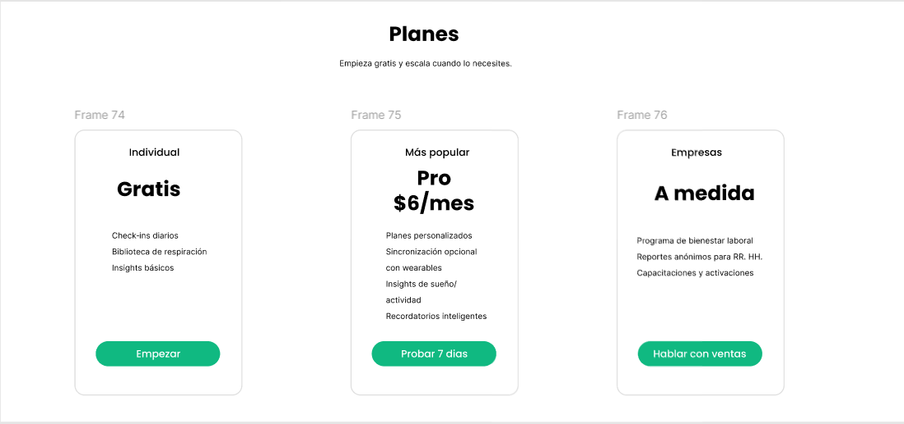
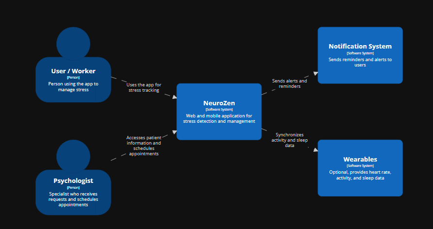
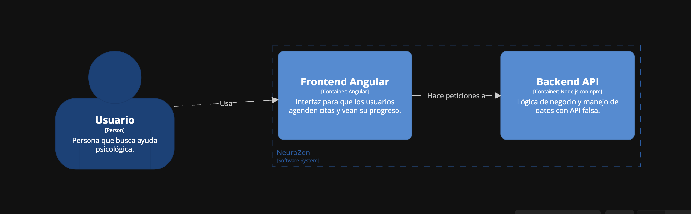
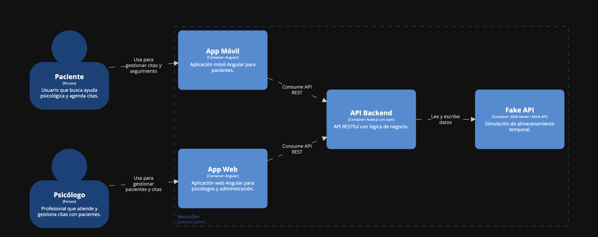

# Capítulo IV: Product Design

---

## 4.1. Style Guidelines.  

### 4.1.1. General Style Guidelines.  

**Tipografía:**

- Fuente primaria: Inter (fallback system-ui, Roboto, Arial).
- Jerarquía:
  - Títulos (h1, h2, h3) → peso 600–700.
  - Texto general → peso 400–500.
  - Labels secundarios → peso 400, .text-muted-600.

**Paleta de colores:**

- Verde (principal): #10b981 (--brand-green).
- Índigo (secundario): #6366f1 (--brand-indigo).
- Texto: #0f172a (--ink).
- Texto secundario: #475569 (--muted).
- Fondos suaves: #f8fafc + degradados.

**Componentes:**
- Botones redondeados estilo pill (.btn-pill).
- Tarjetas con bordes y sombras (.card-popular).
- Íconos en burbujas (.icon-bubble).

### 4.1.2. Web Style Guidelines.  

**Diseño general:**

- Minimalista, con mucho aire (espacios).  
- Fondos con gradientes suaves (`.bg-soft`) y blobs decorativos.  
- Teléfono mockup (`.phone`) para mostrar pantallas de la app.  

**Imágenes recomendadas:**

- Hero section: mockup de app dentro de un `.phone`.  
- Features: ilustraciones pequeñas o íconos representativos.  
- Pricing: tabla de precios con iconografía.  
- CTA final: ilustración relajante (ej. meditación / naturaleza).  

 

**Accesibilidad:**

- Contraste fuerte verde/blanco.  
- Texto alternativo en imágenes (`alt`).  
- Botones con `aria-label` en íconos.

---

## 4.2. Information Architecture.  

### 4.2.1. Organization Systems.  

En la plataforma, se emplean diferentes sistemas de organización del contenido para mejorar la accesibilidad y experiencia de los usuarios, dependiendo del tipo de información que se presenta. Estos sistemas aseguran que los usuarios puedan navegar de manera intuitiva y eficiente por la aplicación. A continuación, se detallan los enfoques utilizados:

---

**Organización Visual del Contenido**

- **Jerárquica (Visual Hierarchy):**  
  La organización jerárquica se aplica en secciones donde es fundamental mostrar una estructura clara de importancia y relevancia, como en el dashboard, los reportes de progreso y las recomendaciones personalizadas.  
  Se emplean tamaños de texto diferenciados, títulos destacados y un orden lógico de presentación, resaltando los elementos más importantes (como botones de acción o métricas clave) para guiar al usuario de forma natural.

- **Secuencial (Step-by-Step):**  
  En tareas que requieren pasos consecutivos, como la autoevaluación emocional o la configuración de un perfil, se utiliza un enfoque paso a paso. Esto asegura que el usuario complete cada acción antes de pasar a la siguiente, reduciendo la confusión y aumentando la claridad del proceso.

**Esquemas de Categorización de Contenido**

- **Por Audiencia (Grupos de Usuarios):**  
  La plataforma distingue entre dos perfiles de usuario principales:  
  - **Empleados:** acceden a funciones de autoevaluación, detección temprana, recomendaciones personalizadas y seguimiento de su progreso.  
  - **Psicólogos:** tienen acceso a herramientas de análisis, consultas y soporte a empleados desde la plataforma.  

- **Por Tópicos:**  
  La categorización por temas se aplica en las secciones de ayuda y soporte. Los usuarios pueden acceder a diferentes categorías como **Preguntas Frecuentes**, **Política de Privacidad** y **Centro de Ayuda**, lo que facilita encontrar información relevante para resolver problemas específicos.

**Implementación en la Interfaz**

La organización jerárquica y secuencial se refleja en el diseño de la interfaz mediante menús claros, tarjetas con íconos, pasos visibles en formularios y botones de acción destacados.  
Los esquemas de categorización por audiencia y por tópicos están integrados en las pantallas de inicio y soporte, donde los usuarios encuentran rápidamente la información más relevante.  

Este enfoque asegura que la experiencia de navegación sea **intuitiva, eficiente y adaptada a las necesidades de cada perfil de usuario**, mejorando la usabilidad y efectividad de la plataforma.

---

### 4.2.2. Labeling Systems.  

La plataforma emplea un sistema de etiquetado **directo, simple y orientado a la acción**, con el fin de facilitar la comprensión rápida de los contenidos y la navegación fluida para ambos tipos de usuarios (empleados y psicólogos).  
Se prioriza la **claridad** en la presentación textual de las secciones, utilizando el menor número de palabras posible y apoyándose en **íconos visuales** para reforzar los mensajes clave.

**Menú de navegación**  
En la barra superior se utilizan etiquetas claras y acompañadas de íconos:

- **Inicio** (icono de casa)  
- **Sobre nosotros** (icono de información)  
- **Servicios** (icono de herramientas)  
- **Cómo funciona** (icono de bombilla)  
- **Planes** (icono de moneda)  
- **Reseñas** (icono de comentarios)  
- **Contacto** (icono de sobre)

---

**Botón principal (CTA)**  
- **Registrarse** → llamada a la acción principal, válida tanto para empleados como para psicólogos.  

 

---

**Sección "Cómo funciona" para Empleados**  
- **Registrarse** (icono de usuario con +)  
- **Realizar autoevaluación** (icono de clipboard)  
- **Recibir recomendaciones** (icono de estrella o varita mágica)  
- **Hacer seguimiento de progreso** (icono de gráfico de líneas)  

 

---

**Sección "Cómo funciona" para Psicólogos**  
- **Registrarse** (icono de usuario con +)  
- **Acceder a reportes** (icono de gráfico de barras)  
- **Conectar con pacientes** (icono de chat o persona)  
- **Dar seguimiento y ajustar terapias** (icono de calendario o check)  

 

---

**Footer**  
En el pie de página se incluyen etiquetas claras y concisas:  

- Aviso legal  
- Política de privacidad  
- Política de cookies  
- Centro de ayuda  
- Contacto de soporte  

También se incorporan **íconos de redes sociales**: Facebook, Instagram, LinkedIn, Twitter.  

 

---

### 4.2.3. SEO Tags and Meta Tags.  

Para la plataforma **SmartSay**, se definen etiquetas SEO y metaetiquetas con el fin de optimizar la visibilidad en buscadores y mejorar la experiencia de los usuarios en redes sociales y navegadores. A continuación, se detallan los ejemplos aplicados en la **Landing Page**:

#### Landing Page

<title>SmartSay - Bienestar emocional y apoyo psicológico en tu empresa</title>
<meta name="description" content="SmartSay conecta empleados y psicólogos en un espacio seguro para gestionar el bienestar emocional dentro de la empresa. Rápido, confidencial y accesible.">
<meta name="keywords" content="SmartSay, salud mental laboral, apoyo psicológico, bienestar emocional, estrés laboral, psicólogos online">
<meta name="author" content="Equipo SmartSay">

<!-- CSS & Icons -->
<link href="https://cdn.jsdelivr.net/npm/bootstrap@5.3.3/dist/css/bootstrap.min.css" rel="stylesheet">
<link rel="stylesheet" href="https://cdn.jsdelivr.net/npm/bootstrap-icons@1.11.3/font/bootstrap-icons.min.css">
<link rel="preconnect" href="https://fonts.googleapis.com">
<link rel="preconnect" href="https://fonts.gstatic.com" crossorigin>
<link href="https://fonts.googleapis.com/css2?family=Roboto&display=swap" rel="stylesheet">
<link rel="stylesheet" href="css/style.css">
<link rel="icon" href="/images/logo.png" alt="Logo">

### 4.2.4. Searching Systems.  

En **SmartSay**, el sistema de búsqueda y filtros está diseñado para que tanto empleados como psicólogos encuentren de manera rápida la información que necesitan dentro de la aplicación. Estos mecanismos simplifican la navegación y permiten acceder de forma más directa a recursos, sesiones o reportes.

#### Filtros de búsqueda por entradas

**Empleados:**
- **Buscar psicólogos disponibles:** Filtrar por nombre, especialidad o nivel de experiencia.  
- **Filtrar por disponibilidad horaria:** Encontrar sesiones libres en horarios compatibles.  
- **Filtrar por modalidad:** Sesiones virtuales individuales o grupales.  
- **Historial de sesiones:** Búsqueda por fecha de sesión o tema tratado.  

**Psicólogos:**
- **Buscar empleados asignados:** Filtrar por nombre o ID del empleado.  
- **Filtrar por estado de cita:** “Pendiente”, “Completada”, “Cancelada”.  
- **Filtrar por fechas:** Consultar calendario de sesiones semanales o mensuales.  
- **Categorías de apoyo:** Filtrar casos por tópicos como “estrés laboral”, “ansiedad” o “rendimiento”.  

#### Filtros de búsqueda por tabs

Para mejorar la experiencia de usuario, se implementarán **tabs interactivos** que organizan la información de forma clara y accesible.

**Empleados:**
- **Tab de psicólogos recomendados:** Visualización personalizada basada en su perfil y necesidades.  
- **Tab de historial de apoyo:** Registro de sesiones pasadas con filtros por fecha y tema.  
- **Tab de búsqueda rápida:** Acceso directo a psicólogos disponibles por horario.  

**Psicólogos:**
- **Tab de agenda de sesiones:** Vista organizada con filtros por día y hora.  
- **Tab de historial de casos:** Registros de sesiones filtrados por empleado o tema.  
- **Tab de reportes:** Acceso a métricas de bienestar agrupadas por fechas o categorías.  

#### Flujo de búsqueda y filtros

El flujo de búsqueda se caracteriza por ser **simple y eficiente**:
1. El usuario selecciona un campo de búsqueda o un filtro.  
2. La información se actualiza en tiempo real, sin necesidad de recargar la página.  
3. Se permite **aplicar múltiples filtros** de forma simultánea.  
4. El usuario puede **eliminar filtros fácilmente** para volver a la vista general.  

---

### 4.2.5. Navigation Systems

En **SmartSay**, la navegación está diseñada para ser **clara, accesible y diferenciada** según el tipo de usuario (empleado o psicólogo). Se busca garantizar que cada perfil encuentre las herramientas clave con la menor fricción posible.

#### 1. Navegación en la Landing Page

La **Landing Page** guía a los usuarios hacia la acción principal: registrarse en la plataforma y conocer sus beneficios.

**Elementos de navegación:**
- **Menú superior fijo** con secciones:  
  - Home  
  - About  
  - Services  
  - How it works  
  - Prices  
  - Testimonials  
  - Contact Us  
- **Llamadas a la acción (CTAs):**  
  - “Sign up as Employee”  
  - “Sign up as Psychologist”  
- **Desplazamiento fluido (scroll):** Permite recorrer secciones sin cambiar de página.  

#### 2. Navegación en la Web Application

La aplicación web ofrece una **navegación adaptada al rol**:

**Para Empleados:**
- **Menú lateral simplificado** con accesos a:  
  - Dashboard  
  - Buscar Psicólogo  
  - Sesiones agendadas  
  - Historial de apoyo  
  - Configuración de perfil  
- **Accesos rápidos:** Botones destacados para reservar una nueva sesión o contactar soporte.  
- **Breadcrumbs:** Para volver fácilmente a secciones anteriores.  

**Para Psicólogos:**
- **Menú lateral extendido** con accesos a:  
  - Dashboard  
  - Agenda de sesiones  
  - Lista de empleados asignados  
  - Historial de casos  
  - Reportes y métricas  
  - Configuración  
- **Accesos rápidos:** Crear reporte, iniciar sesión virtual o enviar recordatorio.  
- **Breadcrumbs:** Para mantener trazabilidad de navegación en sesiones o reportes.  

#### Interacción y accesibilidad

- **Navegación clara y visible:** Íconos + texto para mejorar la comprensión.  
- **Navegación de búsqueda:** Filtros rápidos integrados al menú superior o lateral.  
- **Ayuda contextual:** Guías paso a paso y tutoriales disponibles desde cada sección clave.  
- **Responsive Design:** Adaptación total a escritorio, tablet y móvil.  

## 4.3. Landing Page UI Design.  

### 4.3.1. Landing Page Wireframe.  

### 4.3.2. Landing Page Mock-up.  

## 4.4. Web Applications UX/UI Design.  

---

### 4.4.1. Web Applications Wireframes. 

Diseño para visualizar el login

 

 

 

Diseño para visualizar "Como Funciona"

 

Diseño para visualizar "Planes"

 

Diseño para visualizar "Preguntas Frecuentes"

 

---

### 4.4.2. Web Applications Wireflow Diagrams.  

---

### 4.4.2. Web Applications Mock-ups.  

---

### 4.4.3. Web Applications User Flow Diagrams.  

## 4.5. Web Applications Prototyping.  

# Descripción de la página NeuroZen

## Resúmenes de contenido

Los resúmenes en esta página cumplen el rol de **introducir el propósito
y beneficios de NeuroZen** de forma clara. Cada sección brinda la
información justa para que el usuario entienda de qué trata la app y
decida si quiere saber más o descargarla.

-   En el **header**, se muestra el valor principal: detección y gestión
    del estrés laboral, junto con un formulario para unirse a la lista
    de espera y botones de descarga.\
-   En la sección de **Características**, se resumen los beneficios
    clave (detección temprana, autoevaluación, recomendaciones,
    dashboard, conexión con psicólogos y privacidad).\
-   La sección **Cómo funciona** explica en 4 pasos simples el flujo de
    uso.\
-   La sección de **Planes** resume las opciones (gratis, pro y
    empresas) sin entrar en demasiados detalles técnicos.\
-   En el **FAQ**, se muestran respuestas breves a las dudas más
    comunes.

Principio aplicado: **Divulgación progresiva**. El usuario recibe
solo la información suficiente para decidir si quiere explorar más.

------------------------------------------------------------------------

## Etiquetas

Cada sección de la página está encabezada con una etiqueta clara y
visible que orienta al usuario sobre dónde se encuentra y qué puede
hacer:

-   "Características"\
-   "Cómo funciona"\
-   "Planes"\
-   "Preguntas frecuentes"

Estas etiquetas refuerzan el **principio de las puertas de entrada**,
pues cada sección habla por sí misma y ayuda a establecer un sentido de
ubicación dentro de la página.

------------------------------------------------------------------------

## Menús

La página cuenta con **un único menú principal de navegación** en la
parte superior (sticky, siempre visible):

-   Características\
-   Cómo funciona\
-   Planes\
-   Preguntas frecuentes\
-   Descargar

No existe menú secundario lateral, pero el **footer** funciona como
navegación complementaria hacia apartados de producto, empresa y legal.

Principio aplicado: **Navegación enfocada**. El menú superior lleva a
las secciones principales de decisión (información del producto),
mientras que el footer concentra los enlaces secundarios (legal,
contacto, sobre la empresa).

------------------------------------------------------------------------

## Introducción de los flujos de interacción

Los flujos principales que la página introduce al usuario son:

1.  **Unirse a la lista de espera**
    -   El usuario ingresa su correo electrónico en el formulario y
        recibe confirmación inmediata.
2.  **Descargar la app**
    -   El usuario puede ir directo a App Store o Google Play desde los
        botones destacados.
3.  **Explorar características antes de decidir**
    -   El usuario navega por secciones con resúmenes de funciones y
        planes.
4.  **Elegir un plan**
    -   El usuario puede empezar gratis, probar la versión pro o
        contactar al área de ventas para empresas.
5.  **Resolver dudas rápidamente**
    -   El usuario abre las preguntas frecuentes y obtiene respuestas
        sin abandonar la página.

---

## 4.6. Domain-Driven Software Architecture.  

### 4.6.1. Software Architecture Context Diagram.  

### 4.6.2. Software Architecture Container Diagrams.  

### 4.6.3. Software Architecture Components Diagrams.  

## 4.7. Software Object-Oriented Design.  

---

### 4.7.1. Class Diagrams.  

Para NeuroZen, hemos diseñado un diagrama de clases que muestra la estructura estática del sistema, incluyendo las entidades principales, sus atributos y relaciones. Este diagrama ayuda a entender cómo se organizan y comunican las diferentes partes del sistema.

Clases principales:

- User
- Psychologist
- CheckIn
- Plan
- Notification
- Session

### 4.7.2. Class Dictionary.  

A continuación se describe cada clase y sus atributos:

**Clase: User**
Representa a los usuarios de la aplicación

| Atributo | Tipo de dato | Descripción                     |
| -------- | ------------ | ------------------------------- |
| id       | int          | Identificador único del usuario |
| name     | string       | Nombre del usuario              |
| email    | string       | Correo electrónico registrado   |
| password | string       | Contraseña de acceso            |
| role     | string       | Rol del usuario (user, admin)   |

**Clase: Psychologist**
Especialista que puede agendar sesiones con usuarios.

| Atributo  | Tipo de dato | Descripción                       |
| --------- | ------------ | --------------------------------- |
| id        | int          | Identificador único del psicólogo |
| name      | string       | Nombre completo                   |
| specialty | string       | Área de especialidad              |
| email     | string       | Correo electrónico                |
| phone     | string       | Número de contacto                |

**Clase: CheckIn**
Registro de los niveles de estrés de los usuarios

| Atributo | Tipo de dato | Descripción                                      |
| -------- | ------------ | ------------------------------------------------ |
| id       | int          | Identificador único del check-in                 |
| userId   | int          | Referencia al usuario                            |
| date     | DateTime     | Fecha y hora del check-in                        |
| mood     | string       | Estado del usuario (Calm, Stressed, Overwhelmed) |
| notes    | string       | Observaciones adicionales                        |

**Clase: Plan**
Planes personalizados de bienestar asignados a los usuarios

| Atributo    | Tipo de dato | Descripción                         |
| ----------- | ------------ | ----------------------------------- |
| id          | int          | Identificador del plan              |
| userId      | int          | Referencia al usuario               |
| title       | string       | Nombre del plan                     |
| description | string       | Detalles del plan                   |
| duration    | int          | Duración en días                    |
| status      | string       | Estado del plan (Active, Completed) |

**Clase: Notification**
Notificaciones enviadas a los usuarios para recordatorios o alertas

| Atributo | Tipo de dato | Descripción                            |
| -------- | ------------ | -------------------------------------- |
| id       | int          | Identificador único de la notificación |
| userId   | int          | Referencia al usuario                  |
| message  | string       | Contenido de la notificación           |
| sentAt   | DateTime     | Fecha y hora de envío                  |
| read     | boolean      | Indica si fue leída                    |

**Clase: Session**
Registra citas agendadas con psicólogos

| Atributo       | Tipo de dato | Descripción                                           |
| -------------- | ------------ | ----------------------------------------------------- |
| id             | int          | Identificador único de la sesión                      |
| userId         | int          | Referencia al usuario                                 |
| psychologistId | int          | Referencia al psicólogo                               |
| scheduledAt    | DateTime     | Fecha y hora programada                               |
| status         | string       | Estado de la sesión (Scheduled, Completed, Cancelled) |

## 4.8. Database Design.  

### 4.8.1. Database Diagram.  

El diagrama de base de datos representa visualmente las tablas y sus relaciones para NeuroZen. Cada clase del diseño orientado a objetos corresponde a una tabla en la base de datos, con sus columnas y relaciones.

**Tablas principales y relaciones:**
- Users (id, name, email, password, role)
- Psychologists (id, name, specialty, email, phone)
- CheckIns (id, userId → Users.id, date, mood, notes)
- Plans (id, userId → Users.id, title, description, duration, status)
- Notifications (id, userId → Users.id, message, sentAt, read)
- Sessions (id, userId → Users.id, psychologistId → Psychologists.id, scheduledAt, status)

**Relaciones principales:**
- Users → CheckIns (1 a muchos)
- Users → Plans (1 a muchos)
- Users → Notifications (1 a muchos)
- Users → Sessions (1 a muchos)
- Psychologists → Sessions (1 a muchos)

